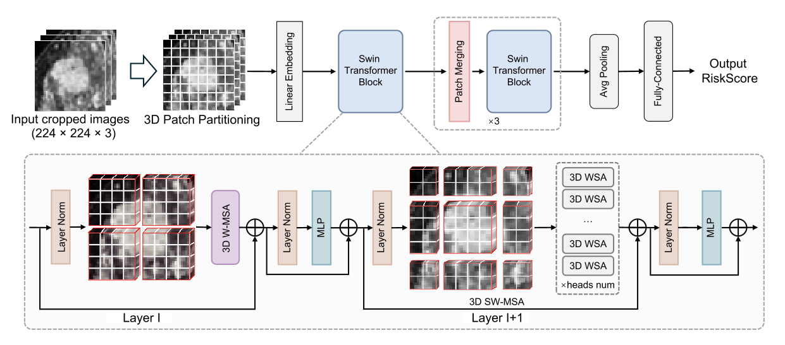

# The Luminal Breast Cancer Imaging (Lumi-I) model
Lumi-I model is a Swin Transformer-based deep learning model designed to predict pathologic complete response (pCR) to neoadjuvant therapy (NAT) in patients with luminal breast cancer. By analyzing three-plane dynamic contrast-enhanced MRI (DCE-MRI) data, the model provides accurate predictions to support clinical decision-making.
This repository supports the research study "Optimizing Personalized Neoadjuvant Therapy in Luminal Breast Cancer Using an Explainable Deep Learning Approach with Cost-effective Clinical Implementation". For inquiries regarding this work, please feel free to contact our team.


## Workflow
1.Three independent plane-specific models are trained separately on axial, coronal, and sagittal images

2.Each planar model outputs the pCR prediction probability from its respective view 

3.Logistic regression integrates predictions from the three planes 

4.Outputs the final Lumi-I score (pCR probability) 

5.Patients are stratified into high- and low-score groups based on an optimal cut-off value determined by the maximum Youden index in the training set

## Key Features
✅ Strong Generalization: AUC ranges from 0.810 to 0.853 across validation and external test sets

✅ Multi-Planar Information Fusion: Leverages complementary information from three anatomical planes

✅ Biological Interpretability: Supports radiogenomic analysis to reveal underlying biological mechanisms

## Requirements

- Python (3.10)
- torch (2.1.0+cu121)
## Usage

1. Data Preparation
	You need to prepare the following files:

	- **Imaging files**: The format should be structured as follows:
		```
		Train_Cohort
		├── Center I
		  ├── Crop_AX_Smax+1_0001_image.nii.gz
		  ├── Crop_AX_Smax+0_0001_image.nii.gz
		  ├── Crop_AX_Smax-1_0001_image.nii.gz
		  ├── Crop_AX_Smax+1_0002_image.nii.gz
		  ...
		├── Center II
		├── Center III
		└── Center IV
		
		Clinical.csv files
		```
		The file names must include the term "Smax", and should also contain one of the following: "Smax+0", "Smax+1", or "Smax-1".    

	- **Clinical files**: These should include the following columns:
		```
	    - `image_paths`:.../Crop_AX_Smax+1_patient_id_image.nii.gz
	    - `fustat`:0
	    - `futime`:78
	    ```		
		
2. Train:
    
     - **Install the PyTorch version with CUDA support.**
    
    ```
     pip install torch==2.1.0+cu121 torchvision==0.16.0+cu121 torchaudio==2.1.0 --index-url https://download.pytorch.org/whl/cu121
    ```
    - **Start training**:You can modify parameters such as epoch and seed in the `train_class.py` file, and then run that file.
    ```
    python train_class.py
    ```
3. Predict:

     - **prediction model**
    ```
        python predict_class.py
    ```

## Contact
If you have any questions, feel free to contact us through email ([chenxb@gdph.org.cn](mailto:chenxb@gdph.org.cn)) or GitHub issues. 
